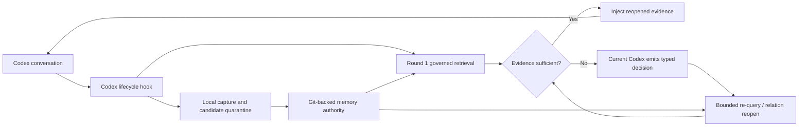

# Codex Memories

**Local-first persistent memory for OpenAI Codex — governed recall, progressive disclosure, and no hosted vector database.**

[](https://github.com/libenxier-beep/codex-memories/actions/workflows/tests.yml)
[](https://www.python.org/)
[](LICENSE)
[](#privacy-and-trust-boundary)
[](#how-it-works)

[中文说明](README_ZH.md) · [Architecture](docs/memory-control-plane.md) · [Validation](docs/retrieval-v2-validation.md) · [Hook protocol](docs/agent-memory-hook-protocol.md)

Codex Memories is a local-first **AI agent memory** runtime for developers who
want Codex to remember durable facts, decisions, preferences, and lessons
without sending a private memory corpus to a hosted memory service. It combines
Git-backed authority, a local SQLite sidecar, bounded hybrid retrieval, and a
three-round progressive disclosure loop driven by the current Codex model.

> [!IMPORTANT]
> **Status: advanced preview / real-world dogfood.** The runtime is active in a
> real Codex environment and its public test suite passes, but the independent
> Large-B3 evaluation was not completed. Read the
> [validation record](docs/retrieval-v2-validation.md) before making quality claims.

## Install in five minutes

Requirements: Python 3.9+, Git, and a local Codex installation.

```bash
git clone https://github.com/libenxier-beep/codex-memories.git
cd codex-memories
./install.sh
~/.local/share/codex-memories/bin/codex-memories doctor
```

The installer creates three deliberately separate surfaces:

| Surface | Default location | Contains |
| --- | --- | --- |
| Runtime | `~/.local/share/codex-memories` | replaceable product code and CLI |
| Authority | `~/.codex/memories` | your private, Git-backed durable memory |
| Sidecar | `~/.codex/memory-sidecar` | disposable indexes, state, and caches |

It never edits `hooks.json`. Instead it writes a digest-bound
`hooks.merge-plan.json` under the runtime directory so the configuration owner
can review and merge it without losing existing hooks. Until that plan is
applied, `doctor` reports `integration: review_required`—the runtime is installed,
but automatic Codex capture and recall are not active yet.

After reviewing the hook plan, try the product CLI directly:

```bash
~/.local/share/codex-memories/bin/codex-memories index
~/.local/share/codex-memories/bin/codex-memories recall "governed local memory"
~/.local/share/codex-memories/bin/codex-memories health
```

See the [Getting Started guide](docs/getting-started.md) for custom paths,
hook-plan review, upgrading, rollback, and troubleshooting.

## Why Codex Memories?

Most long-term memory systems ask you to choose between dumping more context
into every prompt or operating an embedding/vector database stack. Codex
Memories explores a smaller, local-first path:

- **Native Codex lifecycle integration** — capture and recall through
  `SessionStart`, `UserPromptSubmit`, tool, and stop hooks.
- **Progressive disclosure** — easy queries stop after the first local retrieval;
  difficult queries may expand for at most three governed rounds.
- **The current Codex model is the planner** — no nested agent or second remote
  LLM is launched by the memory runtime.
- **Authority before similarity** — indexes propose candidates, but content is
  reopened from exact Git authority before it can enter context.
- **Local-first privacy** — memories, indexes, sessions, and authorization state
  stay on the user's machine; no hosted vector database is required.
- **Fail-closed lifecycle** — scope, privacy, deletion, tombstones, provenance,
  revision, and content hashes are checked before injection.
- **One-command rollback** — switch from the progressive candidate to legacy
  recall without deleting memory data.

## How it works



The retrieval loop maintains a host-owned working set, frontier, visited set,
opaque authorization handles, and strict budgets. Retrieved text is always
untrusted data: it cannot grant itself permission, select arbitrary files, or
become canonical memory merely because it ranked highly.

## Codex Memories compared with common alternatives

| Approach | Strength | Typical trade-off | Codex Memories |
| --- | --- | --- | --- |
| Context stuffing | Simple | Repeats irrelevant tokens | Injects only governed, bounded evidence |
| Hosted memory API | Easy cross-device service | Private memory leaves the machine | Local authority and sidecar state |
| Vector database + reranker | Strong broad semantic recall | More infrastructure and tuning | No hosted vector DB; progressive local retrieval |
| One-shot RAG | Low latency | Can miss paraphrases and multihop evidence | Up to three rounds, only when evidence is incomplete |
| Raw conversation logs | Complete history | Weak lifecycle and provenance | Typed capture, quarantine, tombstones, exact reopen |

This project is not a drop-in replacement for every memory platform. Choose a
managed service when shared cloud memory, a hosted dashboard, or organization-
wide scale matters more than local authority and minimal infrastructure.

## Quick start for contributors

Clone the repository and run the complete synthetic suite:

```bash
git clone https://github.com/libenxier-beep/codex-memories.git
cd codex-memories
python3 -m unittest discover -s tests
```

Inspect the CLI:

```bash
python3 scripts/agent_memory.py --help
python3 scripts/agent_memory.py progressive --help
```

Enable or roll back the progressive runtime using an owner-only local state
directory:

```bash
python3 scripts/agent_memory.py \
  --progressive-state-dir /absolute/owner-only/state \
  progressive enable

python3 scripts/agent_memory.py \
  --progressive-state-dir /absolute/owner-only/state \
  progressive rollback
```

The product installer intentionally generates a review-only hook merge plan: the
hook must remain bound to the deployment's memory authority, trusted
configuration owner, and local `RecallPolicy`. See the
[hook protocol](docs/agent-memory-hook-protocol.md) and
[progressive retrieval guide](docs/progressive-retrieval-v2.md).

## What is included

- `scripts/agent_memory.py` — local runtime and CLI
- `scripts/agent_memory_system/` — capture, lifecycle, governance, retrieval,
  offload, reliability, and storage modules
- `scripts/progressive_knowledge_access.py` — bounded multi-round retrieval loop
- `scripts/progressive_answerability.py` — structured answerability gate
- `scripts/memory_control_plane/` — candidate, authorization, projection, and
  atomic authority control plane
- `schemas/` — machine-readable contracts
- `scripts/codex_memories.py` and `install.sh` — safe installer and deployment doctor
- `tests/` — 287 synthetic unit and integration tests
- `docs/retrieval-v2-validation.md` — successes, failures, costs, and limits

Private memories, Work Context content, runtime databases, hidden evaluation
sets, and consumed seals are deliberately excluded from this repository.

## Validation snapshot

| Surface | Result |
| --- | ---: |
| Published unit and integration suite | **287 / 287 pass** |
| Public synthetic H3 Recall@5, three cold runs | **0.8800 / 0.8867 / 0.8800** |
| Public synthetic no-answer FPR | **0 / 0 / 0** |
| Ordered multihop public slice | **30 / 30** |
| Compact hidden seal Recall@5 | **3 / 6 — rejected** |
| Independent N=180 Large-B3 | **Not executed** |

The public results show that progressive retrieval can work; the failed compact
seal shows that the quality claim is not yet general. See the
[full validation record](docs/retrieval-v2-validation.md) for denominators and
interpretation.

## Privacy and trust boundary

- No memory corpus is uploaded by this runtime.
- No retrieved passage is treated as an instruction.
- Private recall requires an explicit policy-authorized route.
- Re-query remains bound to the original `work` or `personal` scope.
- Active replay sessions are mode `0600` and expire after 24 hours; completed
  sessions remove the raw query immediately.
- Indexes are disposable candidate generators, never authority.

The complete publication boundary is documented in
[docs/github-publication-boundary.md](docs/github-publication-boundary.md).

## FAQ

### Is this a persistent memory system for Codex?

Yes. It captures durable evidence from Codex lifecycle events, forms quarantined
memory candidates, and recalls only policy-approved, source-reopened records on
later prompts.

### Does it require Pinecone, Qdrant, Weaviate, or another vector database?

No hosted vector database is required. The current design uses local disposable
projections and lets Codex request bounded deeper retrieval only when needed.

### Does every prompt run three retrieval rounds?

No. Every eligible prompt gets a local bootstrap retrieval. If the first-round
evidence is sufficient, Codex answers normally. Additional rounds are reserved
for ambiguous, multilingual, temporal, relation, or multihop questions.

### Does the memory runtime call another LLM?

No. The current Codex model supplies typed planner decisions. The runtime itself
does not launch a nested remote model.

### Is Codex Memories better than Mem0, Graphiti, Letta, or MemOS?

That has not been demonstrated. Codex Memories optimizes for a different
constraint set: local authority, Codex-native hooks, progressive disclosure,
and minimal hosted infrastructure. A compact hidden test favored the one-shot
and Mem0 comparators, and that negative result remains public.

### Can I use it today?

Yes, with an explicit final integration step. The guided installer creates an
isolated runtime and starter private authority, then generates a review-only
hook merge plan. A completed large independent benchmark remains future work.

## Contributing

Read [CONTRIBUTING.md](CONTRIBUTING.md) before opening a focused pull request.
Issues are especially useful for:

- reproducible public retrieval benchmarks;
- installation and upgrade feedback across macOS and Linux;
- real-world, privacy-preserving dogfood feedback;
- multilingual and multihop retrieval failures;
- latency and token-usage measurement.

If local-first, inspectable AI memory is useful to you, consider starring the
repository so other Codex users can find it.

## License

Licensed under the [Apache License 2.0](LICENSE).
